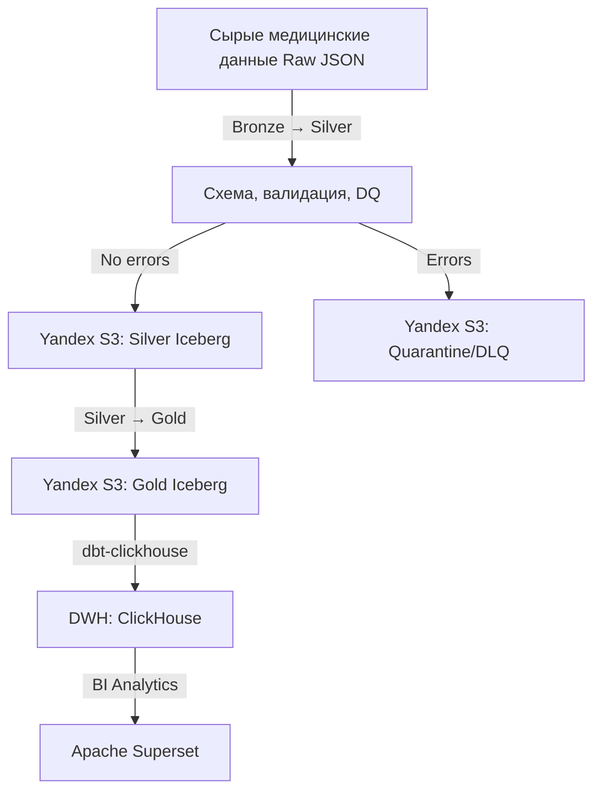
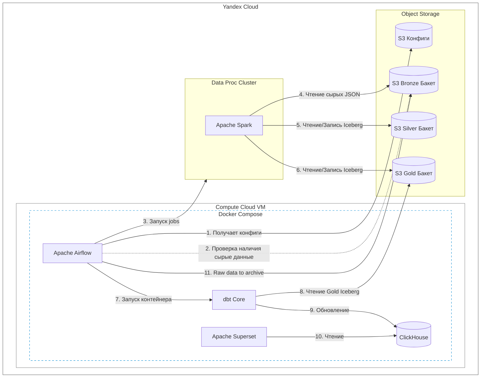
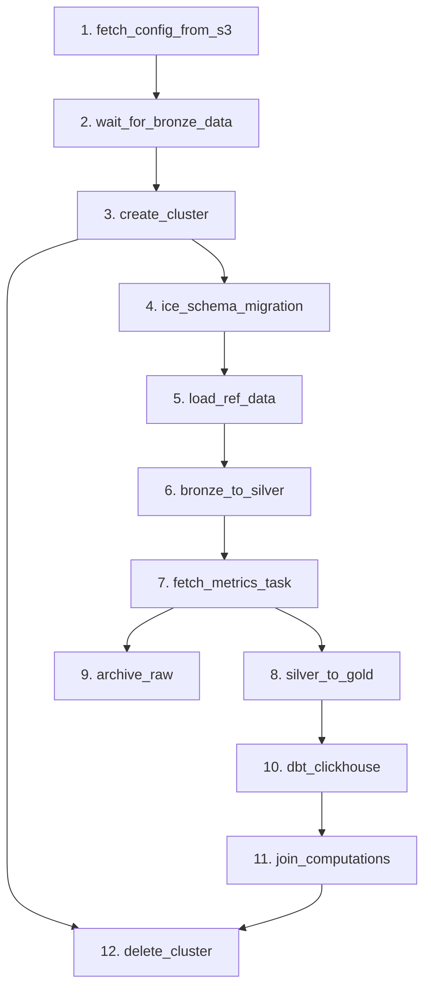

# 🏥 Spark Med Analytics

Высокотехнологичный дата-инженерный пайплайн корпоративного уровня для пакетной (Batch) обработки сырых медицинских данных (истории визитов, хронические заболевания, показатели пациентов).

Проект реализует концепцию **Data Lakehouse** в облаке **Yandex Cloud** с использованием **Apache Spark** и **S3 Object Storage**, транзакционного формата таблиц **Apache Iceberg**, оркестрации в **Apache Airflow**, инкрементальной сборки витрин с помощью **dbt** для **ClickHouse** и визуализации в **Apache Superset**.

---

## 🏗 Концептуальная архитектура потоков данных (Medallion Architecture)



### Поток данных

1. **Bronze Layer:** Исходные JSON-файлы медицинских визитов, поступающие в Yandex Object Storage (S3) по пути `visits/<data>/`.
2. **Bronze ➡️ Silver:** `PySpark`-джоб (`jobs/bronze_to_silver.py`) выполняет кастомную фильтрацию и валидацию данных, отправляя брак в изолированный S3-карантин (с контролем порога `CriticalDataQualityError`), а валидные данные обогащает (ID, BMI, типы дат) и сохраняет в таблицы Silver-слоя.
3. **Silver ➡️ Gold:** `PySpark` (`jobs/silver_to_gold.py`) производит инкрементальную агрегацию данных из Silver-слоя Iceberg (по watermark `created_at`), формируя готовые бизнес-метрики в **Gold Layer (Iceberg)**.
4. **Gold ➡️ ClickHouse (dbt):** Airflow запускает **dbt**, который инкрементально считывает дельту из Gold Iceberg и обновляет аналитические таблицы в **ClickHouse**.
5. **BI-Слой:** Подключенный к ClickHouse **Apache Superset** визуализирует медицинские дашборды и графики.

---

## 🏗 Архитектура системы



---

## 🛠 Технологический стек

* **Облачная инфраструктура:** Yandex Cloud (Вычислительный кластер **Data Proc** для тяжелых Spark-задач, Virtual Machines, Object Storage S3).
* **Контейнеризация:** Docker & Docker Compose (ClickHouse, dbt, Apache Airflow, Apache Superset).
* **Оркестрация:** Apache Airflow (DAG `dwh_core_elthub`, запуск ежедневно в `02:00` UTC).
* **Мониторинг:** Telegram для мгновенного оповещения о сбоях на любом этапе.
* **Табличный формат:** Apache Iceberg (поверх S3).
* **Вычислительный движок:** Apache Spark (PySpark) с кэшированием (`persist(MEMORY_AND_DISK)`).
* **Преобразование данных:** dbt.
* **Аналитическое DWH:** ClickHouse.
* **Качество кода:** Автоматическое тестирование Python-кода с помощью библиотеки **pytest** и линтера **black**.
* **Контроль версий:** Git.
* **CI/CD:** GitHub Actions — автоматический запуск тестов и деплой на VM при push в `main`.

---

## 📁 Структура проекта

```text
├── dags/
│   └── dwh_core_elthub.py        # DAG Airflow: Bronze → Silver → Gold → ClickHouse
├── jobs/                         # PySpark-джобы для Yandex Data Proc
│   ├── bronze_to_silver.py       # Заполнение Silver-слоя, валидация и очистка
│   ├── silver_to_gold.py         # Инкрементальная сборка Iceberg Gold таблиц
│   ├── load_ref_data.py          # Загрузка справочников (departments, professions)
│   └── ice_schema_migration.py   # Синхронизация схем Iceberg таблиц
├── src/                          # Пакет Python (собирается в .whl)
│   ├── core/
│   │   ├── session.py            # Инициализация Spark-сессии
│   │   ├── data_catalog_registry.py  # Реестр каталогов/таблиц из schemas.yaml
│   │   ├── schema_manager.py     # Создание и синхронизация схем Iceberg
│   │   └── writer.py             # MERGE-запись, upsert массивов, карантин
│   ├── utils/
│   │   ├── s3.py                 # Построение S3-путей, чтение CSV
│   │   ├── validate.py           # Правила DQ-валидации (возраст, температура)
│   │   ├── finalize_validation.py# Финальная валидация и подсчёт метрик
│   │   ├── metrics_validate.py   # Класс сбора DQ-метрик (valid_rows, error_percent)
│   │   ├── action_context.py     # Менеджер контекста выполнения Spark-шагов
│   │   ├── errors.py             # Обработка исключений и кодов выхода
│   │   ├── db.py                 # Получение watermark (последней даты)
│   │   └── stats_table_sync.py   # Статистика синхронизации таблиц
│   ├── transforms.py             # Трансформации (cast, id, BMI, даты)
│   ├── decorators.py             # Декоратор @monitor_job для профилирования
│   ├── exceptions.py             # Кастомные ошибки (CriticalDataQualityError)
│   ├── constants.py              # Тексты логов и кодов ошибок
│   ├── config.py                 # Чтение конфигурации из --config_json
│   └── logging_config.py         # Настройка логирования
├── dbt_project/                  # Модели dbt для данных в ClickHouse
│   ├── models/
│   │   ├── staging/stg_iceberg__visits.sql  # Чтение Gold Iceberg через icebergS3()
│   │   ├── marts/mart_visits.sql            # Инкрементальная витрина ClickHouse
│   │   └── schema.yml                       # Описание и тесты модели
│   ├── dbt_project.yml
│   └── profiles.yml              # Профиль подключения к ClickHouse
├── config/
│   ├── dev_config.yaml           # Конфигурация dev-окружения (S3, Data Proc, DQ)
│   ├── test_config.yaml          # Конфигурация test-окружения (аналогично dev)
│   ├── prod_config.yaml          # Конфигурация prod-окружения (аналогично dev)
│   └── schemas.yaml              # Схемы таблиц Bronze/Silver/Gold
├── scripts/
│   └── generate_data.py          # Генерация тестовых медицинских данных
├── tests/                        # Автоматические тесты Python (pytest)
├── .github/
│   └── workflows/ci-cd.yml       # GitHub Actions: тесты + деплой на VM
├── compose.yml                   # Docker Compose: ClickHouse, Airflow, Superset, Jupyter
├── dockerfile.airflow            # Dockerfile для Airflow
├── dockerfile.dbt                # Dockerfile для dbt-clickhouse
├── Makefile                      # Автоматизация сборки и деплоя
├── pyproject.toml                # Конфигурация Python-пакета
├── requirements.txt              # Скомпилированные зависимости
├── requirements-airflow.txt      # Зависимости для Airflow
├── requirements-cloud.txt        # Зависимости для кластера Data Proc
├── .env.example                  # Шаблон переменных окружения
└── README.md
```

---

## 🚀 Порядок развертывания и запуска

### 1. Переменные окружения и конфигурация

Скопируйте шаблон `.env.example` в `.env` и заполните значения:

```bash
cp .env.example .env
```

Конфигурация пайплайна хранится в YAML-файлах в каталоге `config/`. Каждый файл предназначен для работы в своём окружении:

* `config/dev_config.yaml` — конфигурация **dev**-окружения (S3, Data Proc, DQ-правила).
* `config/test_config.yaml` — конфигурация **test**-окружения (аналогично dev).
* `config/prod_config.yaml` — конфигурация **prod**-окружения (аналогично dev).

Выберите подходящий файл конфигурации под ваше окружение, заполните в нём значения (бакеты S3, параметры кластера Data Proc, правила качества данных) и передавайте его в джобы через параметр `--config_json`.

### 2. Инициализация проекта и установка зависимостей

Проект использует **uv** для управления зависимостями:

```bash
make sync
```

### 3. Генерация тестовых данных

Сгенерируйте тестовые медицинские данные в папку `data/`:

```bash
make generate
```

### 4. Запуск инфраструктуры (DWH + BI + Orchestration)

Разверните все необходимые сервисы локально на ВМ или в облачном окружении:

```bash
make docker-up
```

*После запуска:*
* **Apache Superset** — `http://localhost:8088` (дашборды ClickHouse)
* **Apache Airflow** — `http://localhost:8080` (оркестрация DAG)
* **Jupyter (dev)** — `http://localhost:8888` (профиль `dev`)

Остановка и перезапуск:

```bash
make docker-down
make docker-restart
```

### 5. Запуск автоматических тестов

Перед деплоем пайплайна на кластер Yandex Data Proc запустите проверку Python-логики:

```bash
make test
```

Проверка форматирования кода:

```bash
make lint
```

### 6. Сборка и деплой на Yandex Data Proc

Сборка `.whl` пакета и отправка артефактов в S3:

```bash
make build
```

Запуск PySpark-джобов на кластере Data Proc:

```bash
make refs-dev     # Обновление справочников (departments, professions)
make silver-dev   # Заполнение Silver-слоя
make gold-dev     # Сборка Gold-слоя
```

### 7. Работа с dbt

Запуск моделей dbt и тестов в контейнере:

```bash
make dbt-run      # dbt run
make dbt-test     # dbt test
make dbt-docs     # Генерация и просмотр документации (http://localhost:8081)
```

---

## 🔄 CI/CD (GitHub Actions)

Проект использует **Git** для контроля версий и **GitHub Actions** для автоматизации тестирования и деплоя. Пайплайн описан в `.github/workflows/ci-cd.yml` и запускается при push в ветки `main`.
1. **Каждый Pull Request (CI):** Автоматически запускает проверки кода на форматирование и прогоняет юнит-тесты пайплайна. При сбое линтера или тестов слияние с целевой веткой блокируется.

(Попросить пересобрать этот блок. 
Добавить переменные окружения которые необходимо заполнпить в секретах)
---

## ⏰ Оркестрация пайплайна в Apache Airflow

Каждые сутки в **02:00** запускается DAG `dwh_core_elthub`:



1. **fetch_config_from_s3** — загружает конфигурацию и схемы из S3.
2. **wait_for_bronze_data** — ожидает появления сырых данных в бакете Bronze.
3. **create_cluster** — создаёт кластер Yandex Data Proc для Spark-задач.
4. **ice_schema_migration** — синхронизирует схемы Iceberg таблиц (создание/добавление/удаление колонок).
5. **load_ref_data** — загружает справочники (departments, professions).
6. **bronze_to_silver** — валидирует и очищает данные, заполняет Silver-слой.
7. **fetch_metrics_task** — читает DQ-метрики из S3 и логирует их.
8. **silver_to_gold** — инкрементально собирает Gold-слой.
9. **archive_raw** — архивирует обработанные сырые файлы.
10. **dbt_clickhouse** — запускает dbt для обновления витрин ClickHouse.
11. **join_computations** — точка объединения веток пайплайна.
12. **delete_cluster** — удаляет кластер после завершения.

Ключевые особенности графа:

* **Ветвление:** после `fetch_metrics_task` пайплайн разделяется на две параллельные ветки — `silver_to_gold` (сборка Gold-слоя) и `archive_raw` (архивация сырых файлов).
* **Слияние:** `join_computations` объединяет ветку `silver_to_gold → dbt_clickhouse` с остальным пайплайном.
* **Удаление кластера:** `delete_cluster` запускается только после завершения **обоих** предшественников — `create_cluster` и `join_computations` (правило `all_done`), что гарантирует корректное освобождение ресурсов Data Proc даже при сбое в одной из веток.

В случае любого необработанного исключения или падения из-за превышения порога брака данных (`CriticalDataQualityError`), дежурный инженер моментально получает нотификацию в Telegram.

---

## 🧪 Качество данных (Data Quality)

Проект включает встроенный механизм контроля качества данных:

* **Правила валидации** (`config/dev_config.yaml` → `dq_rule`):
  * `min_age` / `max_age` — допустимый диапазон возраста пациента.
  * `min_temp` / `max_temp` — допустимый диапазон температуры тела.
  * `percent_marriage` — критический порог процента брака (по умолчанию 5%).
* **Метрики DQ** (`MetricsValidate`): `total_rows`, `valid_rows`, `invalid_rows`, `error_percent`.
* **Карантин (DLQ):** невалидные записи направляются в изолированный S3-карантин.
* **Критический порог:** при превышении `percent_marriage` джоб останавливается с ошибкой `CriticalDataQualityError`.

---

## 🗄 Слои данных (Medallion)

| Слой | Каталог | Описание |
|------|---------|----------|
| **Bronze** | `iceberg.bronze` | Сырые данные визитов (`visits_raw`) |
| **Silver** | `iceberg.silver` | Очищенные и валидированные данные (`visits`, `visits_symptoms`, `visits_chronic`, `departments`, `professions`) |
| **Gold** | `iceberg.gold` | Агрегированные бизнес-метрики (`visits`) |
| **ClickHouse** | — | Аналитические витрины (`mart_visits`) |

---

## 🧰 Makefile команды

| Команда | Описание |
|---------|----------|
| `make sync` | Создать виртуальное окружение и установить зависимости |
| `make generate` | Сгенерировать тестовые данные в папку `data/` |
| `make test` | Запустить локальные юнит-тесты через pytest |
| `make lint` | Проверить форматирование кода линтером black |
| `make build` | Собрать `.whl` пакет для деплоя на Yandex Data Proc |
| `make refs-dev` | Обновление справочников и отправка статических файлов в облако |
| `make silver-dev` | Запуск скриптов для подготовки слоя silver |
| `make gold-dev` | Запуск скриптов для подготовки слоя gold |
| `make docker-build` | Собрать Docker-образы |
| `make docker-up` | Запустить Docker Compose стек |
| `make docker-down` | Остановить Docker Compose стек |
| `make docker-restart` | Перезапустить Docker Compose стек |
| `make docker-ps` | Показать статус контейнеров |
| `make docker-logs` | Показать логи Airflow |
| `make dbt-run` | Запустить модели dbt |
| `make dbt-test` | Запустить тесты dbt |
| `make dbt-docs` | Сгенерировать и показать документацию dbt |
| `make clean` | Удалить временные файлы, кэш и сборки |
