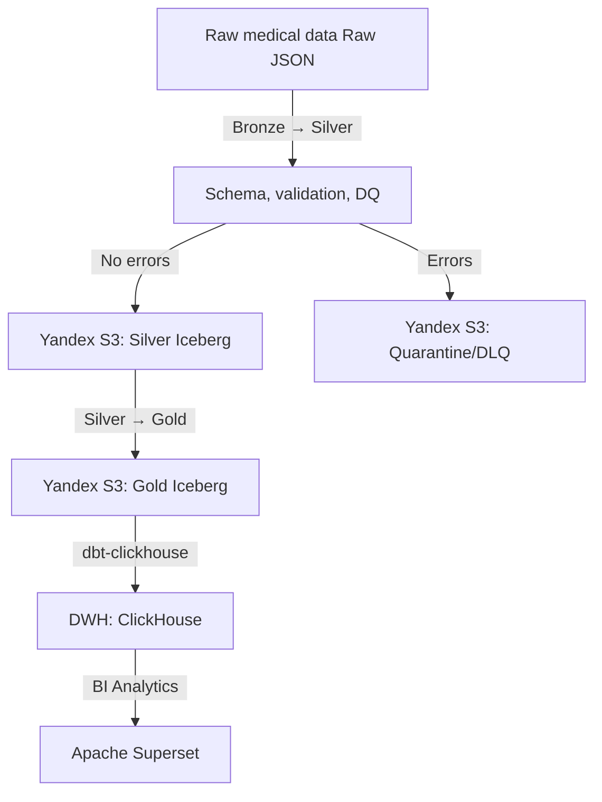
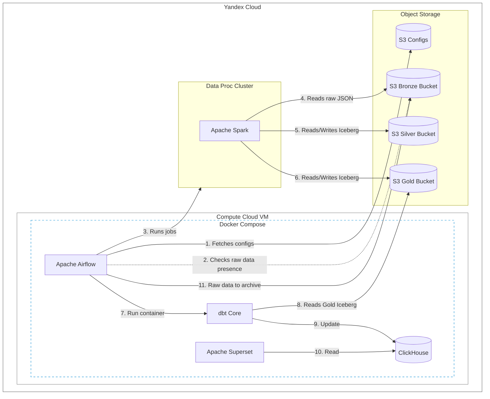
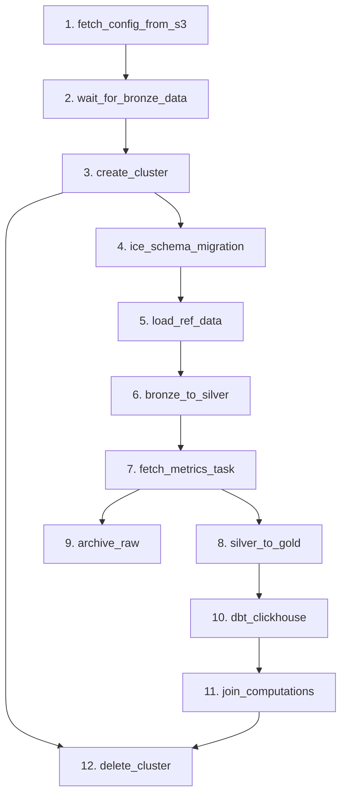

# 🏥 Spark Med Analytics

> **English:** (you are here) | **Русская версия:** [README.ru.md](./README.ru.md)

An enterprise-grade, high-tech data engineering pipeline for **batch** processing of raw medical data (visit histories, chronic diseases, patient metrics).

The project implements the **Data Lakehouse** concept in **Yandex Cloud** using **Apache Spark** and **S3 Object Storage**, the transactional table format **Apache Iceberg**, orchestration with **Apache Airflow**, incremental mart building with **dbt** for **ClickHouse**, and visualization in **Apache Superset**.

---

## 🏗 Conceptual Data Flow Architecture (Medallion Architecture)



### Data Flow

1. **Bronze Layer:** Raw JSON files of medical visits arriving in Yandex Object Storage (S3) at `visits/<data>/`.
2. **Bronze ➡️ Silver:** A `PySpark` job (`jobs/bronze_to_silver.py`) performs custom filtering and data validation, sending defective records to an isolated S3 quarantine (with the `CriticalDataQualityError` threshold control), while valid data is enriched (ID, BMI, date types) and saved to the Silver layer tables.
3. **Silver ➡️ Gold:** `PySpark` (`jobs/silver_to_gold.py`) performs incremental aggregation of data from the Silver Iceberg layer (by the `created_at` watermark), building ready business metrics in the **Gold Layer (Iceberg)**.
4. **Gold ➡️ ClickHouse (dbt):** Airflow runs **dbt**, which incrementally reads the delta from Gold Iceberg and updates the analytical tables in **ClickHouse**.
5. **BI Layer:** **Apache Superset**, connected to ClickHouse, visualizes medical dashboards and charts.

---

## 🏗 System Architecture



---

## 🛠 Technology Stack

* **Cloud infrastructure:** Yandex Cloud (Compute cluster **Data Proc** for heavy Spark jobs, Virtual Machines, Object Storage S3).
* **Containerization:** Docker & Docker Compose (ClickHouse, dbt, Apache Airflow, Apache Superset).
* **Orchestration:** Apache Airflow (DAG `dwh_core_elthub`, runs daily at `02:00` UTC).
* **Monitoring:** Telegram for instant failure alerts at any stage.
* **Table format:** Apache Iceberg (on top of S3).
* **Compute engine:** Apache Spark (PySpark) with caching (`persist(MEMORY_AND_DISK)`).
* **Data transformation:** dbt.
* **Analytical DWH:** ClickHouse.
* **Code quality:** Automated Python testing with the **pytest** library and the **black** linter.
* **Version control:** Git.
* **CI/CD:** GitHub Actions — automated checks (lint + pytest) on PR to `dev`, and deployment to test/prod VMs on push to `test` / `main` (see the "CI/CD and Code Delivery" section).

---

## 📁 Project Structure

```text
├── dags/
│   └── dwh_core_elthub.py        # Airflow DAG: Bronze → Silver → Gold → ClickHouse
├── jobs/                         # PySpark jobs for Yandex Data Proc
│   ├── bronze_to_silver.py       # Fill the Silver layer, validation and cleaning
│   ├── silver_to_gold.py         # Incremental build of Iceberg Gold tables
│   ├── load_ref_data.py          # Loading reference data (departments, professions)
│   └── ice_schema_migration.py   # Iceberg table schema synchronization
├── src/                          # Python package (built into .whl)
│   ├── core/
│   │   ├── session.py            # Spark session initialization
│   │   ├── data_catalog_registry.py  # Catalog/table registry from schemas.yaml
│   │   ├── schema_manager.py     # Creation and synchronization of Iceberg schemas
│   │   └── writer.py             # MERGE writing, array upsert, quarantine
│   ├── utils/
│   │   ├── s3.py                 # Building S3 paths, CSV reading
│   │   ├── validate.py           # DQ validation rules (age, temperature)
│   │   ├── finalize_validation.py# Final validation and metric calculation
│   │   ├── metrics_validate.py   # DQ metrics collection class (valid_rows, error_percent)
│   │   ├── action_context.py     # Execution context manager for Spark steps
│   │   ├── errors.py             # Exception and exit code handling
│   │   ├── db.py                 # Getting the watermark (last date)
│   │   └── stats_table_sync.py   # Table sync statistics
│   ├── transforms.py             # Transformations (cast, id, BMI, dates)
│   ├── decorators.py             # @monitor_job decorator for profiling
│   ├── exceptions.py             # Custom errors (CriticalDataQualityError)
│   ├── constants.py              # Log texts and error codes
│   ├── config.py                 # Reading configuration from --config_json
│   └── logging_config.py         # Logging setup
├── dbt_project/                  # dbt models for data in ClickHouse
│   ├── models/
│   │   ├── staging/stg_iceberg__visits.sql  # Read Gold Iceberg via icebergS3()
│   │   ├── marts/mart_visits.sql            # Incremental ClickHouse mart
│   │   └── schema.yml                       # Model description and tests
│   ├── dbt_project.yml
│   └── profiles.yml              # ClickHouse connection profile
├── config/
│   ├── dev_config.yaml           # dev environment config (S3, Data Proc, DQ)
│   ├── test_config.yaml          # test environment config (same as dev)
│   ├── prod_config.yaml          # prod environment config (same as dev)
│   └── schemas.yaml              # Bronze/Silver/Gold table schemas
├── scripts/
│   └── generate_data.py          # Generation of test medical data
├── tests/                        # Automated Python tests (pytest)
├── .github/
│   └── workflows/
│       ├── dev-pull-request.yml    # CI: lint + pytest on PR to dev
│       ├── test-push.yml           # CD: deploy to test-VM on push to test
│       └── prod-push.yml           # CD: deploy to prod-VM on push to main
├── compose.yml                   # Docker Compose: ClickHouse, Airflow, Superset
├── dockerfile.airflow            # Dockerfile for Airflow
├── dockerfile.dbt                # Dockerfile for dbt-clickhouse
├── pyproject.toml                # Python package configuration
├── requirements-airflow.txt      # Airflow dependencies
├── .env.example                  # Environment variables template
└── README.md
```

---

## 🚀 Deployment & Getting Started

### 1. Cloning the Project

```bash
git clone https://github.com/VasinDK/spark_med_analytics.git
```

### 2. Environment Variables and Configuration

Copy the `.env.example` template into `.env` and fill in the values:

```bash
cp .env.example .env
```

The pipeline configuration is stored in YAML files inside the `config/` directory. Each file is intended for a specific environment:

* `config/dev_config.yaml` — **dev** environment config (S3, Data Proc, DQ rules).
* `config/test_config.yaml` — **test** environment config (same as dev).
* `config/prod_config.yaml` — **prod** environment config (same as dev).

Choose the config file matching your environment and fill in the values (S3 buckets, Data Proc cluster parameters, data quality rules).

### 3. Project Initialization and Dependency Installation

The project uses **uv** for dependency management:

```bash
uv sync
```

### 4. Starting the Infrastructure (DWH + BI + Orchestration)

Deploy all required services locally on a VM or in a cloud environment:

```bash
docker compose dev up -d    # dev/test/prod
```

*After startup:*
* **Apache Superset** — `http://localhost:8088` (ClickHouse dashboards)
* **Apache Airflow** — `http://localhost:8080` (DAG orchestration)

Shutdown:

```bash
docker compose --profile "*" down --remove-orphans
```

### 5. Running the Automated Tests

Before deploying the pipeline to a Yandex Data Proc cluster, run a check of the Python logic:

```bash
uv run pytest tests/
```

Code formatting check:

```bash
uv run black .
```

---

## 🔄 CI/CD and Code Delivery (GitHub Actions)

The project uses **Git** for version control and **GitHub Actions** to automate testing and deployment.

### Branching Model

Code moves through a strict branching model from left to right — `dev` → `test` → `prod`. Production is not fed directly by anything other than ready-to-ship releases from `dev`/`test`.

```
feature_123_functional_description  →  dev  →  test  →  prod (main)
```

* **Feature branches** — `feature_NNN_short_description`, where `NNN` is the task/ticket number. Created from `dev`.
* **`dev`** — the development and integration branch. All features land here via Pull Request.
* **`test`** — the pre-release environment. Receives code from `dev` and is verified on the test VM.
* **`prod` (main)** — the production environment. Receives code from `dev`/`test` and is rolled out to the prod VM.

---

**Stage 1. feature → dev (Pull Request + CI).** A feature branch is created from `dev` and named `feature_123_functional_description`.

```bash
git checkout dev
git checkout -b feature_123_functional_description
# ... work on the task ...
git commit -m "feat(dbt): [#123] add daily sales aggregation"
git push origin feature_123_functional_description
```

When a **Pull Request** is opened to `dev`, the workflow `.github/workflows/dev-pull-request.yml` (**CI**) runs automatically:

1. Dependencies are installed (`uv sync --group dev`).
2. **Unit tests** are executed (`pytest tests/`).
3. Formatting is checked with the **black** linter (`black --check .`).

**What happens:** the code is not deployed anywhere yet. CI only checks code quality. If tests or the linter fail, the PR merge into `dev` is blocked. After a successful check, the feature branch is merged (squash/merge) into `dev`.

**Stage 2. dev → test (push to test, CD).** When features have accumulated and passed review, the build is moved to `test`. A push to `test` is made from the `dev` branch with a release commit:

```bash
git commit -m "release 2026_08_12 feat: 001, 002"
```

A push to `test` triggers the workflow `.github/workflows/test-push.yml` (**CD**). During delivery the following happens:

1. **Build and upload artifacts to S3** — a `.whl` package, the `dependencies.zip` dependencies bundle, Spark jobs (`jobs/`), configuration and schemas are uploaded to the `test` bucket.
2. **Deploy to test-VM** — the code on **test_vm** is updated via SSH, Docker Compose is recreated (if `compose.*`, `dockerfile.airflow`, `requirements-airflow.txt` or `config/` changed), the `dbt-worker` image is rebuilt (if `dbt_project/`, `dockerfile.dbt` changed), and the `airflow-scheduler` is restarted (if `dags/` changed).
3. **Dry run** — all containers are built and started, the pipeline is run against its **own test Iceberg database** (`test` buckets).
   * If all is **OK** — the environment stays as is.
   * If **not OK** — a **rollback** is performed: Iceberg is rolled back to the previous stable state, and on test_vm the branch is reset to the previous release commit.

**Stage 3. dev/test → prod (push to main, CD).** After a successful check on `test`, stable code is moved to production. The `main` branch is updated from `dev`/`test`.

A push to `main` triggers the workflow `.github/workflows/prod-push.yml` (**CD**):

1. **Build and upload artifacts to S3** into the `prod` buckets.
2. **Deploy to prod-VM** — update the code, rebuild Docker Compose and images, restart the scheduler on **prod_vm**.

---

### Environment Variables (what to fill in)

#### Local environment (`.env` / Docker Compose / Airflow container)

The template lives in `.env.example`. Copy it to `.env` and fill in the values:

```bash
cp .env.example .env
```

| Variable | Purpose | Example |
|-----------|------------|--------|
| `SPARK_ENV` | Environment (`dev` / `test` / `prod`). Controls which config is selected | `dev` |
| `TZ` | Time zone | `Europe/Moscow` |
| `CLICKHOUSE_HOST` | ClickHouse host | `localhost` |
| `CLICKHOUSE_DATABASE` | ClickHouse database name | `your-db` |
| `CLICKHOUSE_PORT` | ClickHouse HTTP port | `8123` |
| `CLICKHOUSE_USER` | ClickHouse user | `USER` |
| `CLICKHOUSE_PASSWORD` | ClickHouse password | `your-pass` |
| `AIR_UID` | Airflow user UID | `0` |
| `AIR_DB_ADMIN` | Airflow admin login (and metadata DB user) | `airflow` |
| `AIR_DB_PASS` | Airflow / metadata DB password | `airflow_pass` |
| `AIR_DB` | Airflow metadata DB name | `airflow` |
| `AIR_DB_EMAIL` | Airflow admin email | `hi@air.com` |
| `ICE_ACCESS_KEY_ID` | Access key for Iceberg (S3) | `123456` |
| `ICE_SECRET_ACCESS_KEY` | Secret key for Iceberg (S3) | `123456` |
| `AWS_ACCESS_KEY_ID` | Access key for Yandex Object Storage | `123` |
| `AWS_SECRET_ACCESS_KEY` | Secret key for Yandex Object Storage | `123456` |
| `TG_BOT_TOKEN` | Telegram bot token for alerts | `xxx` |
| `TG_CHAT_ID` | Telegram chat ID for alerts | `xxxx` |
| `SUPERSET_DB` | Superset metadata DB name | `superset_metadata_db` |
| `SUPERSET_USER` | Superset admin login | `admin` |
| `SUPERSET_PASSWORD` | Superset admin password | `admin` |
| `SUPERSET_EMAIL` | Superset admin email | `admin@admin.org` |
| `SUPERSET_SECRET_KEY` | Superset secret key | `123456123456` |

> `TG_BOT_TOKEN` and `TG_CHAT_ID` are read by the DAG `dwh_core_elthub.py` to send Telegram alerts on pipeline failures.

---

### CI/CD Secrets (GitHub → Settings → Secrets and variables → Actions)

The following secrets are used in the workflow files. They must be filled in the repository settings:

| Secret | Environment | Purpose |
|--------|-----------|------------|
| `TEST_YC_AWS_ACCESS_KEY_ID` | test | Access key of the Yandex Cloud static key (S3 artifact upload) |
| `TEST_YC_AWS_SECRET_ACCESS_KEY` | test | Secret key of the Yandex Cloud static key |
| `TEST_SERVER_HOST` | test | test-VM IP/host |
| `TEST_SERVER_USER` | test | SSH user of test-VM |
| `TEST_SSH_PRIVATE_KEY` | test | SSH private key for deploying to test-VM |
| `PROD_YC_AWS_ACCESS_KEY_ID` | prod | Access key of the Yandex Cloud static key (S3 artifact upload) |
| `PROD_YC_AWS_SECRET_ACCESS_KEY` | prod | Secret key of the Yandex Cloud static key |
| `PROD_SERVER_HOST` | prod | prod-VM IP/host |
| `PROD_SERVER_USER` | prod | SSH user of prod-VM |
| `PROD_SSH_PRIVATE_KEY` | prod | SSH private key for deploying to prod-VM |

---

## ⏰ Pipeline Orchestration in Apache Airflow

Every day at **02:00** the DAG `dwh_core_elthub` runs:



1. **fetch_config_from_s3** — loads configuration and schemas from S3.
2. **wait_for_bronze_data** — waits for raw data to appear in the Bronze bucket.
3. **create_cluster** — creates a Yandex Data Proc cluster for Spark jobs.
4. **ice_schema_migration** — synchronizes Iceberg table schemas (create/add/remove columns).
5. **load_ref_data** — loads reference data (departments, professions).
6. **bronze_to_silver** — validates and cleans data, fills the Silver layer.
7. **fetch_metrics_task** — reads DQ metrics from S3 and logs them.
8. **silver_to_gold** — incrementally builds the Gold layer.
9. **archive_raw** — archives processed raw files.
10. **dbt_clickhouse** — runs dbt to update ClickHouse marts.
11. **join_computations** — the point where pipeline branches merge.
12. **delete_cluster** — deletes the cluster after completion.

Key graph features:

* **Branching:** after `fetch_metrics_task` the pipeline splits into two parallel branches — `silver_to_gold` (building the Gold layer) and `archive_raw` (archiving raw files).
* **Merging:** `join_computations` joins the `silver_to_gold → dbt_clickhouse` branch with the rest of the pipeline.
* **Cluster deletion:** `delete_cluster` runs only after **both** predecessors complete — `create_cluster` and `join_computations` (the `all_done` rule), which guarantees correct release of Data Proc resources even if one of the branches fails.

In the event of any unhandled exception, or a failure due to exceeding the data rejection threshold (`CriticalDataQualityError`), the on-call engineer instantly receives a notification in Telegram.

---

## 🧪 Data Quality

The project includes a built-in data quality control mechanism:

* **Validation rules** (`config/dev_config.yaml` → `dq_rule`):
  * `min_age` / `max_age` — the allowed age range of a patient.
  * `min_temp` / `max_temp` — the allowed body temperature range.
  * `percent_marriage` — the critical rejection percentage threshold (default 5%).
* **DQ metrics** (`MetricsValidate`): `total_rows`, `valid_rows`, `invalid_rows`, `error_percent`.
* **Quarantine (DLQ):** invalid records are routed to an isolated S3 quarantine.
* **Critical threshold:** when `percent_marriage` is exceeded, the job stops with a `CriticalDataQualityError`.

---

## 🗄 Data Layers (Medallion)

| Layer | Catalog | Description |
|------|---------|----------|
| **Bronze** | `iceberg.bronze` | Raw visit data (`visits_raw`) |
| **Silver** | `iceberg.silver` | Cleaned and validated data (`visits`, `visits_symptoms`, `visits_chronic`, `departments`, `professions`) |
| **Gold** | `iceberg.gold` | Aggregated business metrics (`visits`) |
| **ClickHouse** | — | Analytical marts (`mart_visits`) |

