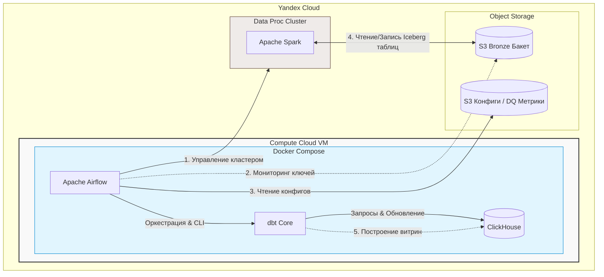
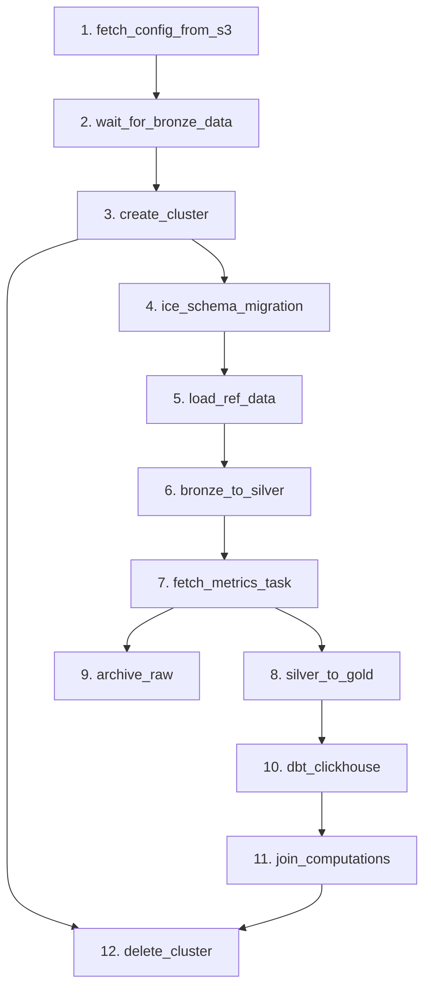

# DWH Core ELT Pipeline (`dwh_core_elthub`)

Репозиторий содержит код оркестрации, трансформации и миграции данных для ядра корпоративного хранилища данных (DWH) в Яндекс Облаке.

## 🏗 Архитектура системы

Пайплайн использует гибридную инфраструктуру: оркестратор и СУБД развернуты локально внутри Docker-окружения на виртуальной машине (Compute Cloud), а тяжелые вычисления вынесены в управляемые сервисы Яндекс Облака.



---

## 📅 Логика и Граф Пайплайна

DAG `dwh_core_elthub` запускается **ежедневно в 02:00 UTC**.

### Схема задач (Lineage)



### Краткое описание этапов:
1. **Подготовка и Ожидание**: Загрузка метаданных из S3 и проверка бакета (`S3KeySensor`) на наличие новых данных.
2. **Вычисления (Spark)**: Динамическое поднятие кластера Yandex Data Proc, миграция схем таблиц Apache Iceberg, обработка и очистка данных из слоя `Bronze` в слой `Silver`.
3. **Параллельная обработка**: 
   * Ветка А: Агрегация данных в слой `Gold` $\rightarrow$ Запуск `dbt` для пересчета витрин в **ClickHouse**.
   * Ветка Б: Архивация обработанных файлов в S3.
4. **Безопасность ресурсов**: Таска `delete_cluster` имеет `trigger_rule=all_done`. Кластер гарантированно удалится, даже если Spark-задачи или dbt упадут с ошибкой.

---

## 🚀 Быстрый старт и CI/CD команды

Для управления проектом на ВМ используется `Makefile`. Все команды выполняются из корня проекта.

### 1. Настройка окружения
Перед первым запуском создайте файл `.env` на ВМ и заполните переменные:
```bash
# Пример .env файла
YC_OAUTH_TOKEN=your_token_here
YC_FOLDER_ID=your_folder_id
S3_BUCKET_NAME=your_dwh_bucket
CLICKHOUSE_HOST=clickhouse
CLICKHOUSE_USER=default
CLICKHOUSE_PASSWORD=secret_password
TELEGRAM_BOT_TOKEN=bot_token
TELEGRAM_CHAT_ID=chat_id
```

### 2. Полезные команды автоматизации
* `make up` — запустить локальную инфраструктуру (Airflow, ClickHouse) в бэкграунде.
* `make down` — остановить контейнеры и очистить временные тома.
* `make logs` — смотреть логи Airflow-воркеров в реальном времени.
* `make lint` — запустить автоматическую проверку качества кода (Black, Flake8).
* `make test-task task=<имя_таски>` — отладить конкретный шаг пайплайна локально (например: `make test-task task=fetch_config_from_s3`).

---

## 🚨 Мониторинг и Алерты

При падении любой задачи или превышении лимита брака данных (`CriticalDataQualityError`):
1. Airflow триггерит встроенный `on_failure_callback`.
2. Дежурный инженер получает мгновенное уведомление в **Telegram** со ссылкой на упавший лог таски.
